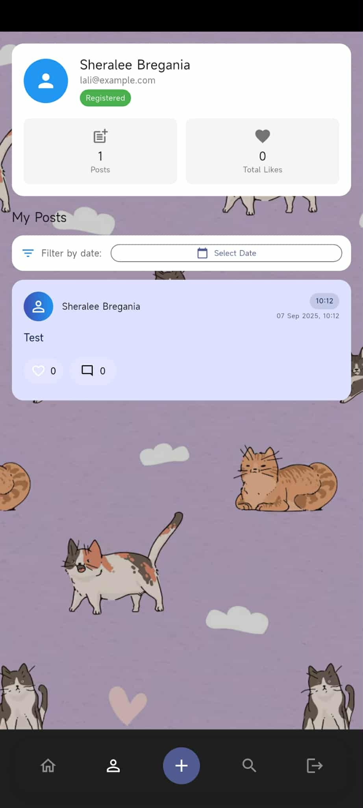
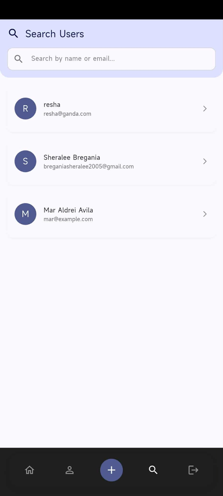
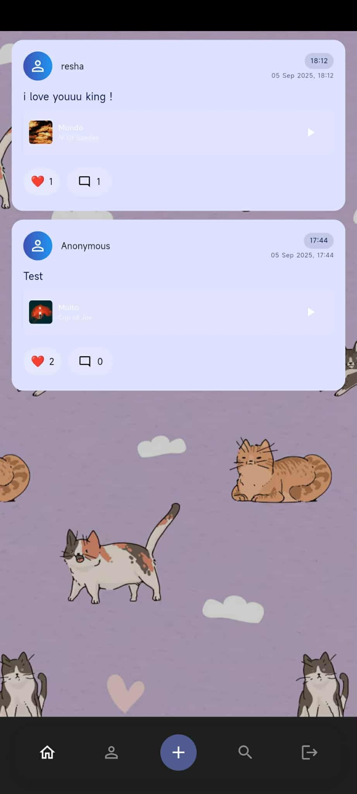

# Freedom Wall - Social Music Sharing App

A modern Flutter social media application that combines anonymous posting with Deezer music integration. Share your thoughts, discover music, and connect with others in a beautiful, immersive interface.

## Features

🎵 **Deezer Integration** - Search and share music tracks directly from Deezer
📱 **Anonymous & Authenticated Posts** - Post anonymously or with your account
🔥 **Real-time Updates** - Firebase-powered real-time post synchronization
💬 **Interactive Posts** - Like, react with emojis, and comment on posts
🖼️ **Media Attachments** - Add images to your posts
🎨 **Modern UI** - Beautiful Material Design 3 interface with immersive background
🔐 **Firebase Authentication** - Secure user authentication and data sync
📱 **Cross-platform** - Works on Android, iOS, Web, and Desktop

## Screenshots

<div align="center">
  
  
  
</div>

*Screenshots showing the main features of Freedom Wall - Social Music Sharing App*

## Getting Started

### Prerequisites

- Flutter SDK (3.8.1 or higher)
- Dart SDK
- Firebase project setup
- Deezer API access

### Installation

1. Clone the repository:
```bash
git clone https://github.com/yourusername/freedom-wall-app.git
cd freedom-wall-app
```

2. Install dependencies:
```bash
flutter pub get
```

3. Configure Firebase:
   - Follow the setup instructions in `FIREBASE_SETUP.md`
   - Add your Firebase configuration files

4. Configure Deezer API:
   - Follow the setup instructions in `SPOTIFY_SETUP.md` (Deezer setup)
   - Add your API credentials

5. Run the app:
```bash
flutter run
```

## Project Structure

```
lib/
├── main.dart                 # Main app entry point
├── auth_service.dart         # Firebase authentication service
├── deezer_service.dart       # Deezer API integration
├── login_page.dart          # User authentication UI
├── profile_page.dart        # User profile management
├── search_page.dart         # Music search functionality
├── post_card.dart           # Post display component
├── music_player_widget.dart # Music player component
└── song_search_widget.dart  # Song search component
```

## Technologies Used

- **Flutter** - Cross-platform mobile framework
- **Firebase** - Backend services (Auth, Firestore)
- **Deezer API** - Music streaming integration
- **Material Design 3** - Modern UI components
- **Audio Players** - Music playback functionality

## Contributing

1. Fork the repository
2. Create your feature branch (`git checkout -b feature/AmazingFeature`)
3. Commit your changes (`git commit -m 'Add some AmazingFeature'`)
4. Push to the branch (`git push origin feature/AmazingFeature`)
5. Open a Pull Request

## License

This project is licensed under the MIT License - see the [LICENSE](LICENSE) file for details.

## Acknowledgments

- Deezer for providing the music API
- Firebase for backend services
- Flutter team for the amazing framework
